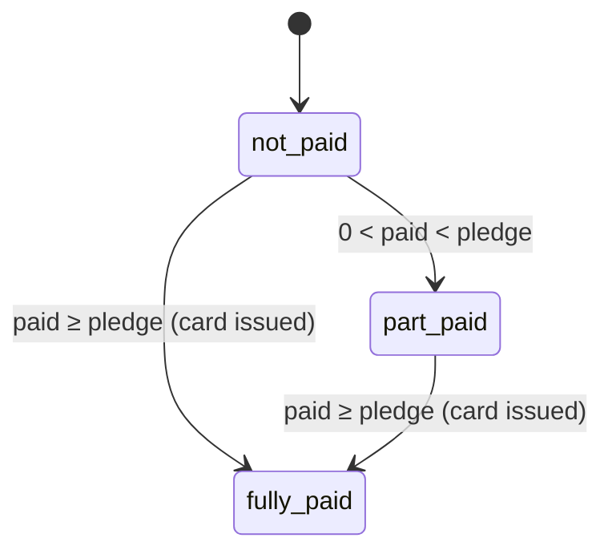

# Contributions (Michango)

## Context

- D-Card records payments made outside the platform; it never holds contribution money.

## Workflow: Contribution to Card
```
Committee/host adds contributor ──► Contribution request (WhatsApp + SMS)
        │
        ▼
Contributor pays OUTSIDE D-Card (M-Pesa / Tigo Pesa / Airtel Money / bank / cash)
        │
        ▼
Treasurer or host records payment ──► Thank-you + balance (WhatsApp + SMS)
        │
        ▼
 ┌─ Card not yet issued? ─────────────────────────────────────────────┐
 │  1. Auto-upgrade: pledged Single AND total paid ≥ Double amount    │
 │        → pledge becomes Double                                     │
 │  2. Total paid ≥ pledge amount → CARD ISSUED AND SENT AUTOMATICALLY│
 └────────────────────────────────────────────────────────────────────┘
```
1. Contributor added with name, phone, pledge amount and card type. The phone is normalised. The Person is found or created. If the Person **already has an invitation for this event**, the existing invitation is opened and no new one is created. Otherwise a new Invitation (`pending`) and Pledge are created.
2. A contribution request with the committee's payment details is sent.
3. The contributor pays outside the platform.
4. A treasurer or the host records each payment (amount, method, reference, date). Part payments are allowed.
5. A thank-you with the balance is sent after each payment.
6. **Auto-upgrade (before issue only, if the event's auto-upgrade setting is on, which is the default):** if the pledge is Single and the total paid reaches the event's **Double amount**, the pledge becomes Double and its amount becomes `max(current pledge, Double amount)`. The change is audited.
7. **Auto-issue:** when total paid ≥ pledge amount, the card is issued at the pledge's card type and sent immediately. **No separate confirm step.**
8. Money beyond the pledge is an **extra contribution**. It counts in the totals and does not change an issued card. If auto-upgrade is **off**, a Single pledge paid at the Double amount stays Single and the difference is an extra contribution.
9. **Manual pledge edits (before issue only):** the host or a treasurer can change the pledge amount and card type (including Double → Single). Every edit is audited, and the contributor gets an updated balance message. If payments already cover the new amount, the card is issued immediately.
10. Only contributors with a balance get reminders, at the host-set frequency.

> **Consequence of rules 6 and 7:** an upgrade only happens if the Double amount is reached **before** the Single pledge is fully paid, which in practice means one payment of the full Double amount. Paying 50k then 50k on a Single pledge issues a **Single** card after the first 50k. The second 50k is an extra contribution.

## Requirements
| ID | Requirement | Pri |
|----|-------------|-----|
| CON-1 | Add contributor with pledge amount and card type. | M |
| CON-2 | **Treasurers (one or more) and the host** record payments: amount, method, reference, date. | M |
| CON-3 | Part payments. Show pledged, paid, balance and extra per contributor. | M |
| CON-4 | Thank-you + balance after each payment. | M |
| CON-5 | **Auto-upgrade** Single → Double before issue when total paid ≥ Double amount, **if enabled for the event (default on)**. | M |
| CON-5a | Host and treasurers can **edit a pledge's amount and card type before issue** (audited, balance message sent, auto-issue if already covered). | M |
| CON-6 | **Auto-issue and send the card** when total paid ≥ pledge amount. No manual confirm step. | M |
| CON-7 | Record **refunds** (negative payment records) and **extra contributions**. | M |
| CON-8 | Balance reminders only to contributors with a balance, at the host's frequency. | M |
| CON-9 | Dashboard: pledged, collected, outstanding, extras, refunds, budget progress, contributors by status. | M |
| CON-10 | Export for committee meetings. | M |
| CON-11 | Every payment edit is audited with old and new values. | M |
| CON-12 | Contribution amounts visible only to the host and committee. | M |
| CON-13 | Automatic payment tracking via a licensed aggregator. | P3 |

## Pledge States

The auto-upgrade can happen in `not_paid` or `part_paid` only. A refund can move `fully_paid` back to `part_paid`, but the issued card stays valid unless the host cancels it.
