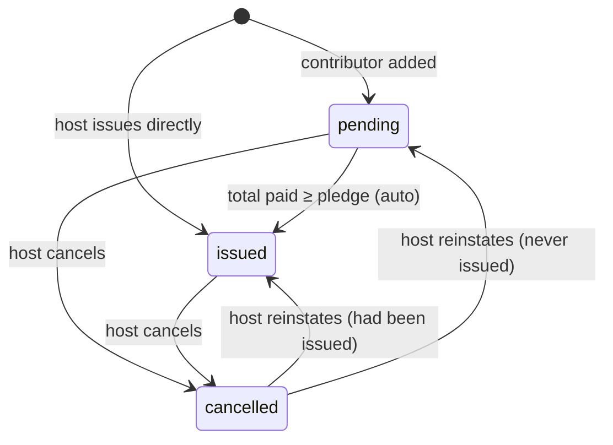

# Guests, Invitations and Cards

## Context

- One Person per phone; one Invitation per Person per event.

## Workflow: Direct Card Issue
The host issues a card directly (single or double). The invitation goes straight to `issued` and the card is sent.

## Workflow: Smartphone Guest
1. Receives the card link by **WhatsApp and SMS**.
2. Opens the link. The **card, QR code, date, venue, programme, table and menu show with no login.**
3. Can optionally sign in with Google or Apple. The link token connects the account to their Person record, so this event and their other invitations are saved to the account.
4. RSVPs, adds dietary needs, adds the event to the calendar. **No login needed.** Polls and song requests need sign-in.
5. If confirmation is on, answers on WhatsApp (Approve/Decline).
6. Shows the QR code at the door.
7. **Registered guests** can later come back and see their event history. **Guests who never sign in** are anonymised 2 weeks after the event (W13).

## Workflow: Basic-Phone Guest
1. Receives SMS messages: contribution request, thank-you, card number, table.
2. If confirmation is on, receives an SMS asking them to **call or text the event contact** to confirm. The host or committee then records the answer in D-Card.
3. Shows or says the card number at the door.
4. Anonymised 2 weeks after the event (they cannot register).

## Workflow: Card Cancellation and Reinstatement
1. The host cancels a card. The invitation becomes `cancelled`, and scans show **Card cancelled**.
2. **Payment records are kept** and still count in totals. Any refund happens outside D-Card and is recorded by a treasurer or the host as a **refund** payment record (negative amount).
3. The host can **reinstate** a cancelled card. It keeps the same card number, QR token and card type, and is audited.

## Requirements
| ID | Requirement | Pri |
|----|-------------|-----|
| GST-1 | One Person per phone number across the platform. | M |
| GST-2 | **At most one Invitation per Person per event.** Adding an existing phone opens the existing invitation. | M |
| GST-3 | Phone numbers normalised to `255` + 9 digits. Invalid numbers are rejected with a clear message. | M |
| GST-4 | Add guests/contributors **one by one** (form). | M |
| GST-5 | **Excel/CSV upload** with a downloadable template and a validation report (invalid phones, duplicates) before import. | M |
| GST-6 | **Pick from phone contacts** (multi-select) in the D-Card app. | M |
| GST-7 | **Copy guests from a past event** of the same host (people only, not pledges, payments or answers). | M |
| GST-8 | Single (1 entry) and double (2 entries, optional partner name) cards. | M |
| GST-9 | Card type fixed once issued. | M |
| GST-10 | Unique card number `NNN-PPPP`, QR token and link token per issued card. | M |
| GST-11 | Host can cancel and reinstate cards. | M |
| GST-12 | RSVP (**Yes / No**) and dietary needs through the card link, **no login needed**. The guest can change the answer until the event starts. Polls and history need login. | M |
| GST-13 | Add to calendar. | M |
| GST-14 | Expected headcount: approved 100%, no response = host % (default 70), declined 0%. Double counts 2. | M |
| GST-15 | Dietary export, seating chart, table by SMS. | P2 |
| GST-16 | Event history for **registered guests** only. | P2 |

## Card Design

- Until admin card templates (EVT-5) exist, every card uses D-Card's built-in design for its event type: event title, guest name(s), date and time, venue, QR code and card number (ADR 0001 O20).

## Access

- Host and committee members add, edit, remove and import guests.
- Treasurers see the guest list read-only (they need it to record payments).
- The host issues, cancels and reinstates cards.
- Door staff and walk-in approvers do not see the guest list in the dashboard.

## Invitation States

Extra flags: `over_used` (entries used > total entries after offline sync), `anonymised` (after retention).
